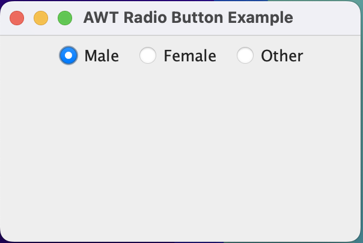
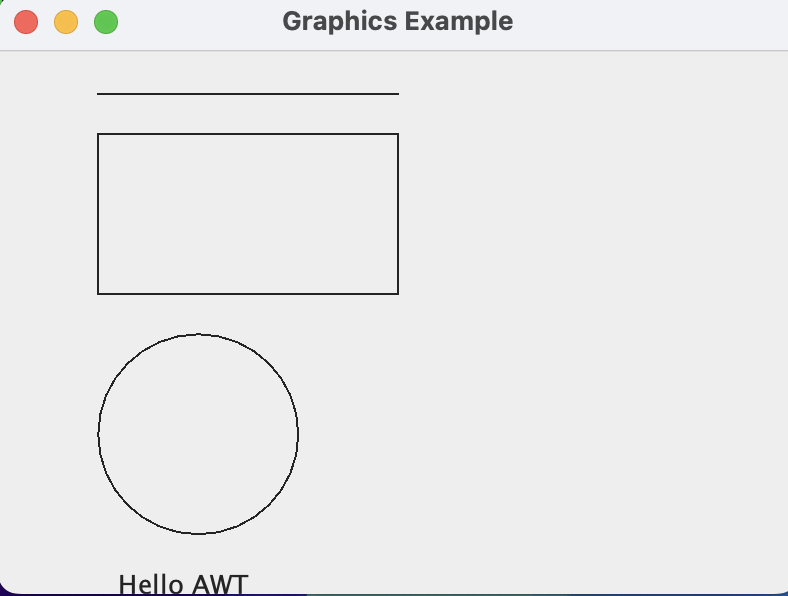

# Java AWT Examples & Portfolio Application

This repository contains a collection of **Java AWT (Abstract Window Toolkit)** programs along with a full-fledged **Portfolio Application** built using AWT.  
These programs demonstrate the fundamentals of GUI programming in Java, including components, events, layouts, graphics, menus, scroll panes, and form handling.

---

## 📂 Project Structure

```
AWT/
│── AWTButtonExample.java
│── CheckboxExample.java
│── RadioButtonExample.java
│── GraphicsExample.java
│── LoginForm.java
|-- BorderLayoutExample.java
│── (Compiled *.class files)

Portfolio/
│── PortfolioApp.java
│── (Compiled *.class files)
```

Each Java file demonstrates a different concept in AWT.

---

# 🎯 AWT Example Programs — Explanation & Significance

## 1. **AWTButtonExample.java**
**Purpose:**  
Shows how to create a window with a **Button** and handle **ActionEvent** when the button is clicked.

**Significance:**  
- Teaches basic component creation  
- Introduces event-driven programming  
- Shows how user interaction works in AWT  


---

## 2. **CheckboxExample.java**
**Purpose:**  
Displays multiple **Checkbox components** (multi-select), each with an event listener to detect state changes.

**Significance:**  
- Demonstrates checkboxes  
- Shows how to capture user selections  
- Builds understanding of `ItemListener`


---

## 3. **RadioButtonExample.java**
**Purpose:**  
Uses `CheckboxGroup` to create **radio-button-like behavior** (single selection only).

**Significance:**  
- Teaches exclusive selection logic  
- Useful for forms (e.g., gender, options)  
- Demonstrates `CheckboxGroup` usage




---

## 4. **GraphicsExample.java**
**Purpose:**  
Shows how to draw shapes (lines, rectangles, circles, text) using the **Graphics class**.

**Significance:**  
- Introduces custom rendering  
- Teaches how painting works in AWT  
- Foundation for making graphical tools, charts, and games




---

## 5. **LoginForm.java**
**Purpose:**  
Implements a simple **Login Form** using TextField, Label, Button, and event handling.

**Significance:**  
- Demonstrates form creation  
- Shows how to read text inputs  
- Example of basic GUI-based authentication systems


---

## 6. **BorderLayoutExample.java**
**Purpose:**  
Demonstrates the use of the **BorderLayout** manager in AWT by placing five buttons in different regions of the layout.

**Significance:**  
- Introduces the **BorderLayout** layout manager  
- Shows how GUI components can be arranged in the regions:  
  - `NORTH`  
  - `SOUTH`  
  - `EAST`  
  - `WEST`  
  - `CENTER`  
- Useful for designing structured and organized UI layouts  
- Teaches how layout managers control component positioning in AWT  

**What it does:**  
Creates a window with buttons placed in each region of the BorderLayout, helping visualize how the layout distributes space.


---

# 🚀 Portfolio Application (Portfolio/PortfolioApp.java)

The **PortfolioApp.java** is a full-scale AWT-based desktop portfolio application that includes:

### ✔️ Menu Bar  
Sections: **About**, **Experience**, **Education**, **Projects**, **Contact**, **Exit**

### ✔️ ScrollPane Support  
Allows long content to scroll smoothly.

### ✔️ CardLayout Navigation  
Each section is displayed as a separate card.

### ✔️ Contact Form  
A functional form with fields:  
- Name  
- Email  
- Phone  
- Message  

Includes validation and shows a confirmation dialog.

### ✔️ Resume-Based Content  
The app uses real content taken from your resume to populate:
- About Section  
- Experience Section  
- Education Section  
- Projects Section  

### ✔️ Professional-Grade UI  
Styled header, section organization, and clean layout.

**Significance:**  
- Demonstrates an entire multi-page GUI  
- Shows real-world AWT usage  
- Useful as an academic project / portfolio showcase  
- Teaches combining menus, panels, layouts, scrollbars, and dialogs  

---


## Working


---

# 🛠️ How to Run the Programs

### **Compile:**
```sh
javac FileName.java
```

### **Run:**
```sh
java FileName
```

### macOS Users (if GUI does not appear):
```sh
java -Djava.awt.headless=false FileName
```

---

# 📌 Requirements
- JDK 8 or above  
- Any Java-supported IDE (IntelliJ IDEA, VS Code, Eclipse) or Terminal

---

# 📜 License
This project is for educational and personal portfolio use.  
You may modify, extend, or reuse the code freely.

---

# 🙌 Author
**Shinjan Saha**  
- GitHub: https://github.com/Shinjan-saha  
- LinkedIn: https://www.linkedin.com/in/shinjan-saha  
